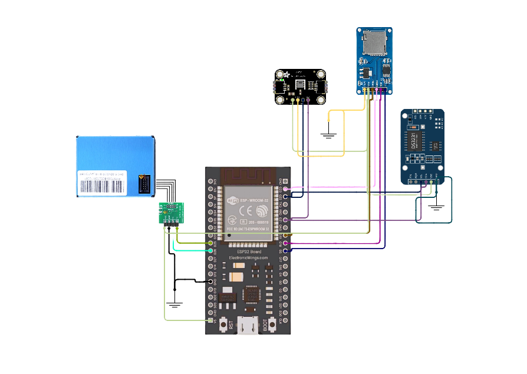

# Air Quality Monitoring System (AQMS)

A low-cost, IoT-enabled **Air Quality Monitoring System (AQMS)** designed to measure  
**PM1, PM2.5, PM10, temperature, and humidity**, with local data logging and real-time cloud
monitoring. The system is designed for scalable deployment in regions where reference-grade
air quality stations are expensive and sparsely available.

---

## Table of Contents

- Overview 
- Circuit Diagram 
- Hardware Components  
- Software Stack  
- Firmware Implementation  
- Backend Implementation  
- Frontend & Admin Panel  
- Power Supply and Reliability  
- Results  
- Limitations  
- Future Work  

---

## Overview

Air pollution—especially fine particulate matter (PM2.5)—poses serious health risks.
Developing countries like Nepal lack dense air quality monitoring networks due to the high
cost of reference-grade instruments and maintenance requirements.

AQMS addresses this challenge by integrating **low-cost environmental sensors**, an
**ESP32-based IoT controller**, **local SD card storage**, and a **cloud-connected admin
panel** for real-time visualization and monitoring. The system is designed for continuous
24/7 operation with automatic power backup and remote supervision.

---

## Circuit Diagram

The complete circuit diagram of the AQMS hardware implementation is shown below.  

---

## Hardware Components

- **ESP32 Development Board** – Main controller with integrated Wi-Fi
- **PMS7003** – Laser-based PM1 / PM2.5 / PM10 particulate matter sensor
- **AHT20** – Temperature and humidity sensor (I2C)
- **DS3231 RTC** – Real-time clock for accurate timestamping
- **MicroSD Card Module** – Local data logging and redundancy
- **18650 Li-ion Batteries** – Backup power supply

---

## Software Stack

### Firmware
- Visual Studio Code, PlatformIO
- Language: C/C++
- Key libraries:
  - PMS7003 sensor library
  - AHT20 sensor library
  - SD card (SPI)
  - RTC (DS3231)
  - Wi-Fi and HTTP client

### Backend
- **FastAPI (Python)**
- REST APIs for:
  - Sensor data ingestion
  - Device health monitoring
  - Battery voltage reporting
- Cloud deployment (Render)

### Frontend
- **Next.js**
- Web-based admin panel for monitoring and visualization

---

## Firmware Implementation

The ESP32 firmware is responsible for:

- Reading PM1, PM2.5, and PM10 values from the PMS7003 sensor via UART  
- Reading temperature and humidity from the AHT20 sensor via I2C  
- Timestamping each measurement using the DS3231 RTC via I2C  
- Logging all sensor data locally on the SD card via SPI  
- Uploading real-time data to the backend server and ThingSpeak via HTTP  
- Detecting network failures and storing unsent data locally  
- Automatically re-uploading previously unsent data when network connectivity is restored  
- Periodically reporting battery voltage levels and overall system status  

The firmware is optimized for reliability and long-term deployment.

---

## Backend Implementation

The backend is implemented using **FastAPI** and serves as the core data management layer.

Key responsibilities include:

- Receiving and validating sensor data
- Storing air quality and system health data
- Tracking battery voltage levels
- Providing APIs for the admin panel
- Triggering alerts when battery voltage drops below safe thresholds and false reading by sensors

The backend supports multiple AQMS devices and is designed for scalable deployment.

---

## Frontend & Admin Panel

The AQMS includes a dedicated **admin panel**, implemented using **Next.js**, which provides:

- Real-time visualization of PM, temperature, and humidity data
- Historical data charts and trends
- Battery voltage monitoring for each deployed device
- System health and connectivity status
- Centralized management of multiple AQMS units

The admin panel enables remote supervision and reduces the need for on-site maintenance.

---

## Power Supply and Reliability

The AQMS is designed for **continuous 24/7 operation**.

- When mains electricity is available:
  - The system runs directly from the main power supply
  - Li-ion batteries are charged automatically
- During power outages:
  - The system seamlessly switches to battery power
  - No interruption occurs in sensing or data logging

Battery voltage levels are continuously monitored by the system and reported to the backend.
If the battery voltage drops significantly below safe operating limits:

- The admin panel displays a warning status
- **Automated WhatsApp alerts** are sent to notify administrators in real time

This design ensures high reliability, uninterrupted operation, and proactive maintenance.

---

## Results

- Successful measurement of PM1, PM2.5, PM10, temperature, and humidity
- Reliable local data storage on SD card
- Stable real-time data upload to cloud services
- Continuous operation during power outages using battery backup
- Effective remote monitoring via admin panel

---

## Limitations

- PMS7003 measurements are influenced by humidity and temperature
- Sensor accuracy degrades after approximately 2–3 years of continuous use
- Real-time data transmission depends on network availability
- Raw PM values are not calibrated in the current implementation

---

## Future Work

### Data Collection
- Long-term co-location with reference-grade air quality monitors
- Collection of high-resolution temporal and environmental datasets
- Data acquisition across multiple seasons and geographic locations

### Machine Learning Calibration
- Development of calibration models for low-cost sensors
- Models to be explored:
  - Linear Regression
  - Random Forest
  - Neural Networks
  - LSTM for time-series calibration
- Correction for sensor drift, humidity effects, and aging

### System Enhancements
- Solar-powered deployment for remote locations
- Advanced alert rules and reporting
- Mobile application integration
- Over-the-air (OTA) firmware updates
